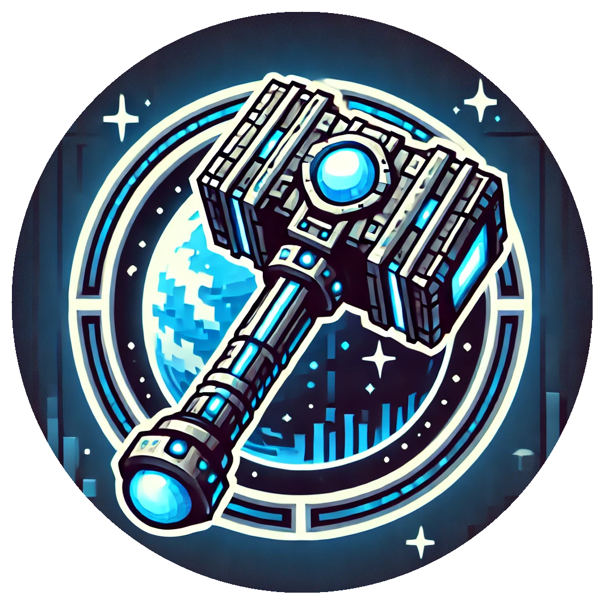

# Vibranium

**Vibranium** is a NeoForge mod that introduces a powerful new resource line, custom gear, and a compact set of worldgen features built around **Vibranium crystals**, **Soulwood**, and **Enriched Vibranium** soil. It aims to feel like a natural expansion to vanilla progression: find rare ore, upgrade your gear, and unlock unique tools and effects that change how you explore and fight.

---

## **Supported Versions**
**Actively supported (full updates and fixes):**
- **Minecraft 1.21.1**
- **Minecraft 1.21.11 (main)**

**Legacy builds (no active updates, only critical fixes if needed):**
- **Minecraft 1.21**
- **Minecraft 1.21.4**
- **Minecraft 1.21.5**
- **Minecraft 1.21.6 - 1.21.8**
- **Minecraft 1.21.9**
- **Minecraft 1.21.10**

---

## **✨ Features**
✅ **Vibranium Resource Line**
- **Deepslate Vibranium Ore**, **Raw Vibranium**, **Ingots**, **Nuggets**, **Plates**, and a **Vibranium Core**.
- **Block of Raw Vibranium** and **Vibranium Block**.
- **Vibranium Upgrade Smithing Template** for gear progression.

✅ **Vibranium Tools & Combat Gear**
- Full **tool set** (sword, pickaxe, axe, shovel, hoe).
- **Vibranium Mace**: mines a **3x3 area** (hold **Shift** to mine a single block) and the push effect **deals damage** to affected enemies.
- **Vibranium Shield**: blocks melee hits and can **reflect arrows** back.

✅ **Vibranium Armor & Trims**
- Full **armor set**, plus **Wolf Armor**, **Horse Armor**, and **Turtle Helmet**.
- **Vibranium Armor Trim Material** using **Vibranium Crystal Shard**.

✅ **Kinetic Redistribution Effect**
- **Heart Shaped Herb**, **Soul Herb Mixture**, and **Soul Herb Elixir** grant **Kinetic Redistribution**.
- When damaged, stored energy **pushes back nearby enemies** and **deals damage**.
- The elixir also grants **Speed**, **Regeneration**, **Absorption**, and **Damage Boost** for a short duration.

✅ **Soulwood Set**
- **Soulwood** log/wood variants, planks, stairs, slab, door, trapdoor, fence, gate, pressure plate, button.
- **Soulwood Leaves**, **Sapling**, **Signs** and **Hanging Signs**, **Boat** and **Chest Boat**.

✅ **Worldgen & Biome Flavor**
- **Vibranium Geodes** with crystal growth.
- **Heart Shaped Herb Bushes** and **Soulwood Trees** can spawn inside **Vibranium Geodes**.
- **Enriched Vibranium Dirt** patches can appear inside geodes.
- **Enriched Vibranium Dirt/Farmland** (can be created by right-clicking with Raw Vibranium).
- **Enriched Vibranium Farmland** boosts crop growth over time.
- Mining **Enriched Vibranium Dirt/Farmland** with a **hoe** can yield **Raw Vibranium** or **Vibranium Nuggets**.

✅ **Loot & Progression**
- **Heart Shaped Herb** can appear in **Ruined Portal chests**.
- **Vibranium Upgrade Smithing Template** can appear in **Trial Chambers** chests.

✅ **Universal Breaker Enchantment**
- **Mace-only enchantment** that lets the 3x3 mining break **all block types** in the area.
- Without it, the Mace only breaks the **same block type** as the center block you targeted.

✅ **JEI / REI Compatibility**
- Shows **brewing recipes** for Soul Herb Elixirs (JEI/REI).
- JEI adds **item descriptions** for Heart Shaped Herb, Vibranium Core, Vibranium Upgrade Smithing Template, and Enriched Vibranium Dirt/Farmland.

❌ **Vibra Golem (Prototype / WIP)**
- Currently **not fully usable in normal gameplay**.
- **No natural spawns** yet; the spawn egg is **command-only** (not in creative tabs).

---

## **🌍 Languages**
The mod includes the following translations:
- **English (en_us)** — AI translated
- **German (de_de)**
- **French (fr_fr)** — AI translated
- **Chinese (Simplified) (zh_cn)** — thanks to **@shenyx110**
- **Spanish (es_es)** — AI translated

---

## **⚙️ Configuration Options**
The Vibranium Mace includes simple config options via **`client-config.toml`** and **`server-config.toml`**.

<strong>Client Configuration</strong> (<code>client-config.toml</code>)

| Option | Default | Description |
|--------|---------|-------------|
| `red` | `0.0` | Outline color - red component (0.0 - 1.0). |
| `green` | `0.0` | Outline color - green component (0.0 - 1.0). |
| `blue` | `0.0` | Outline color - blue component (0.0 - 1.0). |
| `alpha` | `0.6` | Outline color - alpha component (0.0 - 1.0). |

<strong>Server Configuration</strong> (<code>server-config.toml</code>)

| Option | Default | Description |
|--------|---------|-------------|
| `fastMode` | `false` | Use fast 3x3 mining (better performance, less detailed block handling). |

---

## **🧭 Tips & Notes**
- The **Vibranium Mace** highlights its 3x3 mining area; adjust colors in the client config.
- **Heart Shaped Herb** can be harvested directly from its bush when fully grown.

> Press the **outline toggle key** (default **O**) to enable/disable the 3x3 preview.

---

#### 📢 **Found a bug or have a suggestion?**
Report issues to the [Issue Tracker](https://github.com/BigBull-H3RO/Vibranium/issues)

#### 💡 Find out more about Vibranium on [Curseforge](https://www.curseforge.com/minecraft/mc-mods/vibranium-neoforge) or [Modrinth](https://modrinth.com/mod/vibranium)

