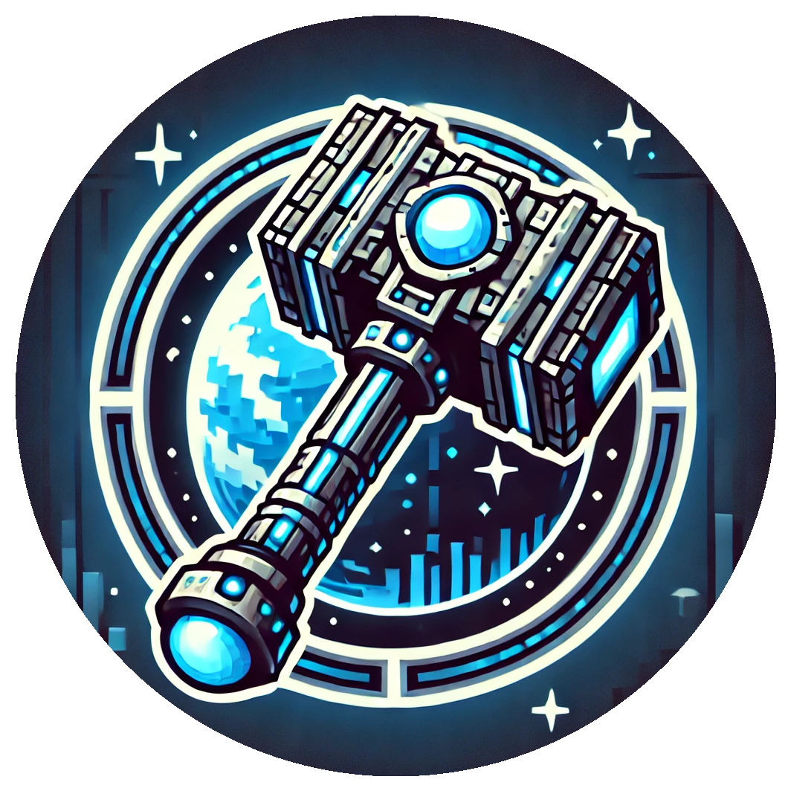

<h1 align="center">Vibranium   
	
	
	
    
      
</h1>

Welcome to the **Vibranium Mod**, an exciting addition to your Minecraft experience that introduces a powerful new resource and a variety of innovative tools and features.

Discover **Vibranium**, a rare and valuable ore that empowers you to craft an array of unique items. With Vibranium, you can create durable **Vibranium Armor** to protect yourself, as well as specialized **Wolf and Horse Armor** to safeguard your loyal companions.

Equip yourself with **Vibranium Tools**, including the essential sword, pickaxe, axe, shovel, and hoe, designed to withstand the toughest challenges. For those who seek efficiency, the **Vibranium Mace Hammer** allows you to mine in a 3x3 area, making resource gathering faster and more enjoyable.

But the Vibranium Mod offers more than just tools. Deep beneath the earth, you may encounter the mysterious **Vibra Golem**. This powerful entity can be tamed and will loyally follow and protect you on your adventures, adding an exciting new dimension to your underground explorations.

Immerse yourself in the world of Vibranium and discover how this extraordinary material can change the way you play Minecraft. Whether you're a builder, an explorer, or a fighter, the Vibranium Mod offers something for everyone.

<h1></h1>
<h4 align="center">Please report issues to the <a href="https://github.com/BigBull-H3RO/Vibranium/issues">Issue Tracker</a></h4>
<h4 align="center">Find out more about Create on our <a href="https://www.curseforge.com/minecraft/mc-mods/create">Curseforge</a> or <a href="https://modrinth.com/mod/create">Modrinth</a> Page</h4>
